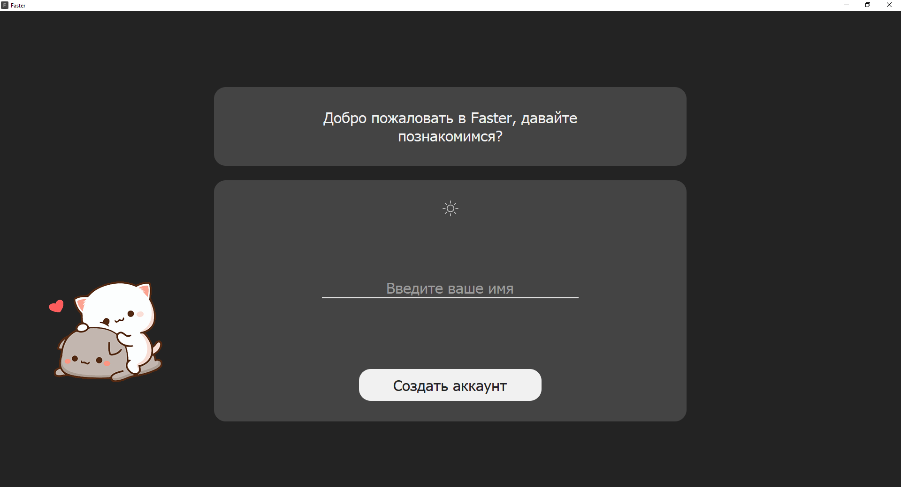

# Faster Пояснительная записка #
***
## Автор ##
Дмитрий niotu Лукиянов
***
## Идея и заявленные функции ##

Faster - программа-приложение для тренировки слепой печати и заучивания стихов.
Программа представляет собой многостраничное приложение с возможностью выбора тренировки и добавления собственных тренировок.

В приложении присутствуют: темная тема, аудиосопровождение тренировок, а также подбор случайного стиха из интернета.
***
## Реализация ##

### Основные классы ###
* MainWindow - класс отвечающий за взаимосвязь всех окон между собой. Класс является наследником класса QStackedWidget.
* LoginPage - класс отвечающий за  окно регистрации.(котята мяукают при нажатии)

* MenuPage - класс отвечающий за окно выбора тренировки.(двойное нажатие ПКМ для выбора)

* WritingSession - класс отвечающий за само окно тренировки.

* SettingsPage - класс отвечающий за окно настроек.

* Parser - класс отвечающий за парсинг стихов с сайта stihi.ru
### Основные Функции ###
* set_theme - функция принимает boolean параметр is_dark_theme и меняет тему в зависимости от значения параметра.
* load_from_db - функция, которая загружает тексты из базы данных 
* load_from_internet - функция, которая подгружает данные из класса Parser
* load_file_to_db - функция, которая загружает текст в базу данных
* check_lines - функция, которая проверяет правильность набора текста 
***
## Технологии ##
> Графисеческий интефейс проекта выполнен при помощи библиотеки PyQt5

> Парсинг данных выполнен при помощи библиотеки lxml

> Загрузка данных выполнена при помощи библиотеки requests 

> Разработка дизайна интефейса выполнена в приложениях QtDesigner и Figma